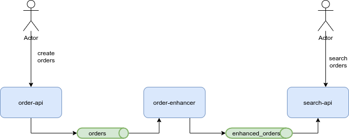

# dojo-quarkus-mp-messaging
A Quarkus dojo to experiment MicroProfile reactive messaging with Kafka

First, start the Kafka broker using the provided docker compose: 

```
docker-compose up
```

Then, you will develop an application with three components:

- [order-api](order-api): A REST API to manage orders, each time an order is created it will send a Kafka message with the new order.
- [order-enhancer](order-enhancer): A messaging component that listens to order messages and enhance them with user information.
- [search-api](search-api): A REST API to search for enhanced orders. It listens to enhanced order messages.



Before going to the various steps of the dojo, please take some time to read the following documentations:

- [Smallrye Reactive Messaging](https://smallrye.io/smallrye-reactive-messaging/smallrye-reactive-messaging/2.5/index.html)
- [Smallrye Reactive Messaging - Concepts](https://smallrye.io/smallrye-reactive-messaging/smallrye-reactive-messaging/2.5/concepts.html)

You can refer to the Quarkus [USING APACHE KAFKA WITH REACTIVE MESSAGING](https://quarkus.io/guides/kafka) guide at any time.

## Step 1

For this step, you can refer to the [Sending / Receiving messages from non-reactive code](https://smallrye.io/smallrye-reactive-messaging/smallrye-reactive-messaging/2.5/emitter/emitter.html) documentation.

- Go to the [order-api](order-api) and open the `fr.loicmathieu.dojo.quarkus.messaging.order.api.OrderResource` REST endpoint.
- Define an `Emitter<Order>` configured with the `orders`. This channel is already configured in the `application.properties`.
- Update the `create(Order order)` method to use this emitter to send the Order to the broker.

Start the application with ̀`mvn package:dev`.

You can send orders to the endpoint with this curl: 

```
curl -XPOST -d '{"nbItem":2, "totalPrice": 200, "userId": "user1", "shippingAddress": "1 rue du Paradis à Lille"}' \
    -H "Content-Type: application/json" \
    http://localhost:8080
```

NOTE: The user service of the `order-enhancer` is able to handle the users with id  "user1", "user2" and "user3".

## Step 2

- Go to the [order-enhancer](order-enhancer) and open the `fr.loicmathieu.dojo.quarkus.messaging.order.enhancer.MessageManager`.
- Create a method that takes an `Order` as parameter and return the `EnhancedOrder` enhanced with the User information recovered from the `UserService`.
- Annotate this method so it listens to the `orders` channel and send the enhanced order to the `enhanced-orders` channel. 
These channels are already configured in the `application.properties`.
You can read the section [The price converter](https://quarkus.io/guides/kafka#the-price-converter) of the Quarkus Kafka guide for an exemple.
- Add some logging to see if the message arrives.

Start the application with `mvn package:dev` and create orders on the order API.

## Step 3

- Go to the [search-api](search-api) and open the `fr.loicmathieu.dojo.quarkus.messaging.search.MessageManager`.
- Create a method that takes an `EnhancedOrder` as parameter and save if via the `EnhancedOrderService.add()` method.
- Annotate this method so it listens to the `enhanced-orders` channel. This channel is already configured in the `application.properties`.

Start the application with ̀`mvn package:dev`.

After creating a new order via the order API, you should have this order enhanced, then available via the search API.

You can test the search endpoint via:

```
curl http://localhost:8081
```